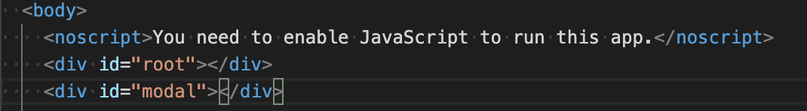

# React createPotal 리액트 모달창 띄우기

## 모달 사용하기

React는 최상위 컨테이너인 `<div id="root></div>`에 모든 컴포넌트가 렌더링된다.(CRA기준)

Modal은 어떤 컴포넌트에서 불러와도 최상위에 보여져야 하기 때문에 컴포넌트 트리를 벗어나는게 깔끔하다고 한다.

이럴 땐 `ReactDOM.createPortal(child, container)`을 사용하면 된다.

우선 `root`컨테이너 밑에 새로운 컨테이너를 추가한다.


그리고 나서 불러올 Modal 컴포넌트를 만든다.

```Js
import React, { Fragment } from "react";
import { createPortal } from "react-dom";

...

const LoginModal = () => {
  const ID = document.getElementById("modal");

  return (
    <Fragment>
      {createPortal(<BackdropStyle />, ID)}
      {createPortal(<ModalOverayStyle>로그인 창</ModalOverayStyle>, ID)}
    </Fragment>
  );
};

export default LoginModal;
```

이제 클릭 이벤트를 통해 모달 창을 불러오자

```js
import React, { useState } from "react";
import LoginModal from "./LoginModal";

const Login = () => {
  const [isLogin, setIsLogin] = useState(false);
  const [onLoginModal, setOnLoginModal] = useState(false);

  const onModalHandler = () => {
    setOnLoginModal(true);
  };

  const onLogoutHandler = () => {
    setIsLogin(false);
  };

  const Login = <button onClick={onModalHandler}>로그인</button>;
  const signOut = <button onClick={onLogoutHandler}>로그아웃</button>;

  return (
    <div>
      {!isLogin ? Login : signOut}
      {onLoginModal ? <LoginModal /> : null}
    </div>
  );
};

export default Login;
```

`onLoginModal` `state`의 값이 `true`가 되면 Modal 창이 나타나게 된다.
