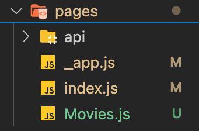

# Next JS 라우팅

NextJs 프로젝트를 생성하면 루트 디렉토리에 pages 디렉토리가 있고 여기에 만든 파일명 그대로 페이지가 생성된다.

`index.js`가 `http://localhost:3000/`의 주소를 가지고 새롭게 만든 파일명을 붙여주면 이동가능하다

> ex) `http://localhost:3000/Movies/`

그런 다음 next의 Link를 사용해 페이지를 라우팅 하면 손쉽게 페이지 이동이 가능하다.
