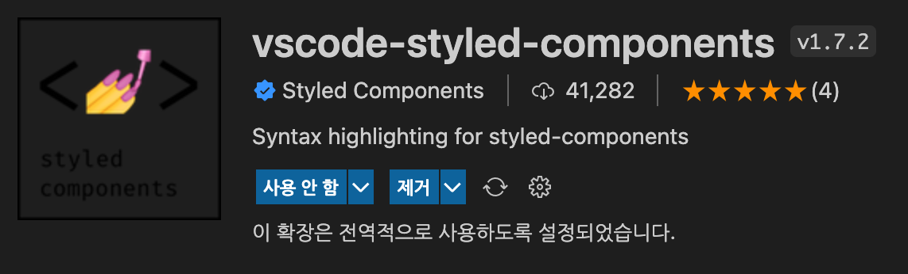

# StyledComponents 참고사항

---

## 패키지 설치

```bash
npm i styled-components
```

---

## Naming Convention

1. 최상위 부모

- `'컴포넌트명'Layout`으로 생성

2. 최상위 부모 자식(바로 하위 요소)

- `'컴포넌트명'Row` or `'컴포넌트명'Col`
- `Row`나 `Col`이라는 실질적인 태그는 `div`,`section`태그등이 될 수 있다.
- `Row`는 가로, `Col`은 세로
  - 둘 다 실제 태그는 `div`여도 `flex-direction`으로 설정
- 최상위 부모가 대분류 느낌이라면 이건 소분류 느낌

3. 나머지 요소

- 네이밍 예시

  - `div`태그: `'컴포넌트명'Box`
  - `section`태그: `컴포넌트명'Section`
  - `ul`태그: `컴포넌트명'List`
  - `li`태그: `컴포넌트명'Item`
  - `p`태그: `컴포넌트명'Paragraph`
  - `span`태그: `컴포넌트명'Span` or `'컴포넌트명'Text`

4. 지양할 사항

- `Styled'컴포넌트명'`: 앞에 Styled 사용을 지양할 것
- ` ~~Wrapper`: `div`태그 같은것에는 사용하지만 이 대신 `Box`라는 이름을 사용한다.

  5. 예시 HTML

  ```html
  <div>
    <!-- 1. Layout -->

    <div>
      <!-- 2. Row / Col (optional) -->
      <div>
        <!-- 3. Box -->
        <ul>
          <!-- 3. List  -->
          <li>
            <!-- 3. Item  -->
            <span>Text</span>
            <!-- 3. Text  -->
          </li>
        </ul>
      </div>
    </div>

    <div>
      <!-- 2. Row / Col (optional) -->
      <div>
        <!-- 3. Box -->
        <ul>
          <!-- 3. List  -->
          <li>
            <!-- 3. Item  -->
            <span>Text</span>
            <!-- 3. Text  -->
          </li>
        </ul>
      </div>
    </div>
  </div>
  ```

---

## Global Style 지정하기

별도 컴포넌트를 만들 필요 없이 `App.js` 에서 만들 수 있다.

```js
import React, { Fragment } from "react";
import styled, { createGlobalStyle } from "styled-components";

const GlobalStyle = createGlobalStyle`
  body {
    box-sizing: border-box;
    margin: 0;
    padding: 0;
  }
`;

...

const App = () => {
  return (
    <Fragment>
      <GlobalStyle />
      <Component1 />
      <Component2 />
    </Fragment>
  )
}
```

전역으로 font-family 설정 가능

```js
const GlobalStyle = createGlobalStyle`
  body {
    @import url('https://fonts.googleapis.com/earlyaccess/notosanskr.css');
    font-family: "Noto Sans KR", sans-serif !important;
  }
`;
```

---

## 동적 선택자 사용

```js
const Button = styled.button`
  background-color: black;

  &:hover {
    background-color: white;
  }
`;
```

---

## props로 값 전달받기

```js
const button = styled.button`
  background-color: ${(props) => props.color || "salmon"};
`;

const App = () => {
  return (
    <div>
      <Button color>버튼</Button>
      <Button color={"black"}>버튼</Button>
    </div>
  );
};
```

---

## animation 사용하기

animation을 사용하려면 `props`를 이용하면 된다.

```js
import React from "react";
import styled, { keyframes } from "styled-components";

const BoxFade = keyframes`
from {
    opacity: 0;
    transform: translateY(3rem);
  }

  to {
    opacity: 1;
    transform: translateY(0);
  }
`;

const BoxStyle = styled.div`
  padding: 1rem;
  max-width: 50rem;
  width: 90%;
  margin: 2rem auto;
  background-color: #fafafa;
  border-radius: 15px;
  box-shadow: 0 2px 8px rgba(0, 0, 0, 0.25);
  animation: ${BoxFade} 1s ease-out forwards;
`;
```

---

## VSCode Styled-components 자동완성

CSS는 스타일링을 할 때 자동완성이 되서 편한데
React에서 Styled-components을 사용하면 자동완성이 안되서 아쉽다
이럴 땐 vscode extension중 `vscode-styled-components`를 설치하면 된다


## 참고 링크

[너드팩토리님 블로그](https://blog.nerdfactory.ai/2019/10/25/react-styled-components.html)

[Seungho Lee님 블로그](https://medium.com/@shlee1353)

[Hi-Fi-Club](https://github.com/Hi-Fi-Club/FE/wiki/Styled-Components-%3A-Naming-Convention)
